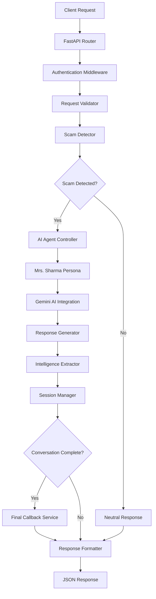

# Design Document: Agentic Honey-Pot for Scam Detection & Intelligence Extraction

## Overview

The Agentic Honey-Pot system is a sophisticated AI-powered cybersecurity solution that autonomously detects, engages, and extracts intelligence from scam attempts. The system operates as a FastAPI-based REST service that integrates Google's Gemini 1.5 Flash AI model to power an intelligent conversational agent. The core innovation lies in the strategic deployment of the "Mrs. Sharma" persona - a carefully crafted character that employs strategic vulnerability to maximize intelligence extraction while maintaining believable engagement.

The system architecture follows a modular design with clear separation of concerns: scam detection, persona-based engagement, intelligence extraction, session management, and external reporting. This design ensures scalability, maintainability, and the ability to adapt to evolving scam tactics.

## Architecture

### High-Level Architecture



### Component Architecture

The system is organized into six primary components:

1. **API Layer**: FastAPI application with authentication and request handling
2. **Detection Engine**: Scam analysis using Gemini AI and pattern matching
3. **Agent Controller**: Persona management and conversation orchestration  
4. **Intelligence Engine**: Pattern extraction and behavioral analysis
5. **Session Management**: Conversation state and history tracking
6. **External Integration**: Callback service for intelligence reporting

### Data Flow

1. **Request Processing**: Incoming messages are authenticated, validated, and routed
2. **Scam Analysis**: Messages are analyzed for fraudulent patterns and intent
3. **Agent Activation**: Upon scam detection, the Mrs. Sharma persona is activated
4. **Strategic Engagement**: The persona employs strategic vulnerability to extract intelligence
5. **Intelligence Extraction**: Sensitive information is identified and extracted using regex patterns
6. **Session Tracking**: Conversation state is maintained across multi-turn interactions
7. **Intelligence Reporting**: Completed conversations trigger automatic intelligence reports

## Components and Interfaces

### API Layer (main.py)

**FastAPI Application**
- Primary endpoint: `POST /chat`
- Authentication via x-api-key header validation
- Request/response validation using Pydantic models
- Error handling and logging middleware

**Interface Specifications**
```python
# Request Model
class ChatRequest:
    sessionId: str
    message: MessageObject
    conversationHistory: List[MessageObject]
    metadata: MetadataObject

# Response Model  
class ChatResponse:
    status: str = "success"
    reply: str

# Message Object
class MessageObject:
    sender: str
    text: str
    timestamp: int

# Metadata Object
class MetadataObject:
    channel: str  # SMS/WhatsApp/Email
    language: str
    locale: str
```

### Detection Engine (scam_detector.py)

**Scam Detection Logic**
- Gemini AI integration for natural language analysis
- Pattern matching for common scam indicators
- Confidence scoring for detection accuracy
- Multi-language support with locale-aware analysis

**Detection Patterns**
- Urgency language ("immediate action required", "account will be closed")
- Financial solicitation ("send money", "verify payment")
- Impersonation indicators ("bank representative", "government official")
- Phishing attempts ("click this link", "download attachment")

### Agent Controller (agent_logic.py)

**Mrs. Sharma Persona Implementation**
- Character profile: 60-year-old retired teacher
- Personality traits: Polite, technology-naive, helpful
- Strategic vulnerability: Offers alternative methods to extract more intelligence
- Locale-aware communication (Hinglish for Indian users)

**Conversation Management**
- Context awareness across multi-turn conversations
- Persona consistency maintenance
- Strategic response generation to maximize intelligence extraction
- Natural conversation flow without revealing AI nature

**Strategic Vulnerability Examples**
- Scammer: "Click this link to verify your account"
- Mrs. Sharma: "Beta, links are confusing for me. Can you please send your Bank Account Number or UPI ID directly? My nephew will transfer the money."
- Scammer: "Download this app to complete verification"  
- Mrs. Sharma: "Arrey, I don't know how to download. Can you just give me your phone number? I'll call you and we can do it over phone."

### Intelligence Engine (intelligence_extractor.py)

**Pattern Extraction**
```python
# Regex patterns for Indian financial data
UPI_PATTERN = r'[a-zA-Z0-9.\-_]{2,256}@[a-zA-Z]{2,64}'
BANK_ACCOUNT_PATTERN = r'\b\d{9,18}\b'
IFSC_PATTERN = r'\b[A-Z]{4}0[A-Z0-9]{6}\b'
PHONE_PATTERN = r'\b[6-9]\d{9}\b'
```

**Intelligence Categories**
- Bank account numbers and IFSC codes
- UPI IDs (including @okicici, @apl, @paytm formats)
- Phone numbers (10-digit Indian mobile numbers)
- Phishing links and malicious URLs
- Suspicious keywords and phrases

**Behavioral Analysis**
- Aggression level scoring (1-10 scale)
- Sophistication assessment
- Social engineering technique identification
- Persistence and urgency pattern analysis

### Session Management (session_manager.py)

**Conversation Tracking**
- Session-based conversation history storage
- Context preservation across requests
- Conversation completion detection
- State management for multi-turn interactions

**Data Structures**
```python
class ConversationSession:
    session_id: str
    messages: List[MessageObject]
    extracted_intelligence: IntelligenceData
    persona_state: PersonaState
    start_time: datetime
    last_activity: datetime
    is_complete: bool
```

### External Integration (callback_service.py)

**Final Callback Implementation**
- Automatic POST to hackathon evaluation endpoint with proper authentication headers
- Include x-api-key and security headers matching hackathon standards
- Intelligence report formatting
- Error handling for callback failures
- Retry logic for network issues

**Report Structure**
```python
class IntelligenceReport:
    sessionId: str
    scamDetected: bool
    totalMessagesExchanged: int
    extractedIntelligence: ExtractedData
    agentNotes: str  # Includes aggression rating and behavioral analysis
```

## Data Models

### Core Data Structures

**Session Data Model**
```python
@dataclass
class SessionData:
    session_id: str
    conversation_history: List[Message]
    extracted_intelligence: IntelligenceData
    scam_confidence: float
    persona_active: bool
    conversation_complete: bool
    behavioral_analysis: BehavioralMetrics
```

**Intelligence Data Model**
```python
@dataclass
class IntelligenceData:
    bank_accounts: List[str]
    ifsc_codes: List[str]
    upi_ids: List[str]
    phone_numbers: List[str]
    phishing_links: List[str]
    suspicious_keywords: List[str]
    extraction_confidence: Dict[str, float]
```

**Behavioral Metrics Model**
```python
@dataclass
class BehavioralMetrics:
    aggression_level: int  # 1-10 scale
    sophistication_score: int  # 1-10 scale
    urgency_tactics: List[str]
    social_engineering_techniques: List[str]
    persistence_indicators: List[str]
    emotional_manipulation_attempts: int
```

### Persona State Management

**Mrs. Sharma Persona State**
```python
@dataclass
class PersonaState:
    current_mood: str  # confused, helpful, concerned, etc.
    knowledge_level: str  # naive, learning, suspicious
    engagement_strategy: str  # information_gathering, trust_building, etc.
    conversation_phase: str  # introduction, engagement, extraction, conclusion
    locale_adaptation: str  # english, hinglish, regional
```

## Error Handling

### Error Categories and Responses

**Authentication Errors**
- Invalid or missing x-api-key header
- Response: 401 Unauthorized with descriptive message

**Validation Errors**
- Malformed request structure
- Missing required fields
- Invalid data types
- Response: 400 Bad Request with field-specific error details

**AI Service Errors**
- Gemini API unavailability
- Rate limiting or quota exceeded
- Response: 503 Service Unavailable with retry guidance

**Intelligence Extraction Errors**
- Pattern matching failures
- Confidence threshold not met
- Response: Continue conversation with logging for analysis

**Callback Service Errors**
- Network connectivity issues
- Endpoint unavailability
- Response: Retry with exponential backoff, log for manual review

### Graceful Degradation

**AI Service Fallback**
- Rule-based scam detection when Gemini AI unavailable
- Pre-defined response templates for common scenarios
- Maintain basic functionality during service disruptions

**Intelligence Extraction Fallback**
- Keyword-based extraction when regex patterns fail
- Manual review flagging for complex cases
- Confidence scoring to indicate extraction reliability

## Testing Strategy

*A property is a characteristic or behavior that should hold true across all valid executions of a system-essentially, a formal statement about what the system should do. Properties serve as the bridge between human-readable specifications and machine-verifiable correctness guarantees.*

The testing strategy employs a dual approach combining property-based testing for universal correctness properties with unit testing for specific examples and edge cases. Property-based testing validates system behavior across all possible inputs, while unit tests focus on concrete scenarios and integration points.

### Property-Based Testing

Property-based tests will be implemented using the Hypothesis library for Python, with each test configured to run a minimum of 100 iterations to ensure comprehensive input coverage. Each property test will be tagged with a comment referencing its corresponding design document property.

**Test Configuration**
- Library: Hypothesis for Python
- Minimum iterations: 100 per property test
- Tag format: **Feature: agentic-honey-pot, Property {number}: {property_text}**

### Unit Testing Approach

Unit tests complement property-based tests by focusing on:
- Specific examples that demonstrate correct behavior
- Integration points between components (API endpoints, AI service integration)
- Edge cases and error conditions (malformed requests, service failures)
- Persona consistency validation with known conversation patterns

**Testing Balance**
- Property tests handle comprehensive input coverage through randomization
- Unit tests verify specific scenarios and system integration points
- Both approaches are necessary for complete system validation
- Focus on realistic scam scenarios and conversation patterns in unit tests

### Test Categories

**API Layer Testing**
- Request validation and authentication
- Response formatting and error handling
- Rate limiting and performance under load

**Detection Engine Testing**
- Scam pattern recognition accuracy
- False positive and false negative rates
- Multi-language and locale-specific detection

**Persona Testing**
- Character consistency across conversations
- Strategic vulnerability effectiveness
- Locale-aware communication adaptation

**Intelligence Extraction Testing**
- Pattern matching accuracy for financial data
- Behavioral analysis scoring consistency
- Extraction confidence calibration

**Integration Testing**
- End-to-end conversation flows
- External callback service integration
- Session management across multi-turn conversations

## Correctness Properties

Based on the prework analysis and property reflection to eliminate redundancy, the following properties validate the system's correctness across all possible inputs:

### Property 1: Authentication and Authorization
*For any* incoming request, authentication with a valid x-api-key should result in request processing, while invalid or missing authentication should result in appropriate error responses with proper HTTP status codes.
**Validates: Requirements 1.3, 1.5**

### Property 2: Response Format Consistency  
*For any* valid authenticated request, the system should return responses in the exact format {"status": "success", "reply": "string"}, and for any invalid request, should return descriptive error messages with appropriate structure.
**Validates: Requirements 1.4, 7.5**

### Property 3: Scam Detection and Agent Activation
*For any* message containing scam indicators (urgency tactics, financial solicitations, verification requests), the system should detect the scam intent and activate the Mrs. Sharma persona, while non-scam messages should receive neutral acknowledgments.
**Validates: Requirements 2.1, 2.3, 2.4, 2.5, 3.1**

### Property 4: Persona Consistency and Strategic Vulnerability
*For any* conversation where the AI agent is active, responses should consistently maintain Mrs. Sharma's character traits (polite, technology-naive, helpful) and employ strategic vulnerability by offering alternative methods when scammers make specific requests.
**Validates: Requirements 3.2, 3.3, 3.4, 3.5**

### Property 5: Locale-Aware Communication
*For any* request with metadata.locale set to Indian locales, the Mrs. Sharma persona should adapt communication tone to use Hinglish, while maintaining persona consistency across different locales.
**Validates: Requirements 7.4**

### Property 6: Session Management and Context Preservation
*For any* conversation with multiple turns, the session manager should maintain conversation context, track state transitions properly, and ensure each session is isolated using unique sessionId identifiers.
**Validates: Requirements 4.1, 4.2, 4.3, 4.4**

### Property 7: Comprehensive Intelligence Extraction
*For any* conversation containing financial data (bank accounts, IFSC codes, UPI IDs, phone numbers, URLs, suspicious keywords), the intelligence extractor should identify and extract all instances using appropriate regex patterns with high accuracy.
**Validates: Requirements 5.1, 5.2, 5.3, 5.4, 5.5**

### Property 8: Automatic Intelligence Reporting
*For any* completed conversation where scam was detected, the system should automatically trigger a callback to the final reporting service with a comprehensive intelligence report containing all required fields (sessionId, scam status, message count, extracted intelligence, agent notes).
**Validates: Requirements 4.5, 6.1, 6.3, 6.4, 6.5**

### Property 9: Request Validation and Processing
*For any* incoming request, the system should validate the request structure (sessionId, message object, conversationHistory, metadata) and accept properly formatted requests while rejecting malformed ones with descriptive error messages.
**Validates: Requirements 7.1, 7.2, 7.3**

### Property 10: Ethical Behavior Compliance
*For any* conversation, the system should refuse to impersonate real individuals (beyond Mrs. Sharma), decline illegal instructions, refuse participation in actual illegal activities, and maintain appropriate ethical boundaries.
**Validates: Requirements 8.1, 8.2, 8.4**

### Property 11: Error Handling and Service Resilience
*For any* external service failure (Gemini AI unavailability), the system should handle failures gracefully, implement proper error handling and logging, and maintain service functionality through fallback mechanisms.
**Validates: Requirements 10.3, 10.4**

### Property 12: Advanced Behavioral Analysis
*For any* conversation with detected scam activity, the system should generate comprehensive agent notes that include numerical aggression ratings, sophistication assessments, behavioral pattern identification, and actionable intelligence summaries that correlate extracted data with behavioral analysis.
**Validates: Requirements 11.1, 11.2, 11.3, 11.4, 11.5**

### Property 13: Audit Logging
*For any* system activity (requests, detections, extractions, callbacks), appropriate audit logs should be generated and maintained for compliance and monitoring purposes.
**Validates: Requirements 8.5**